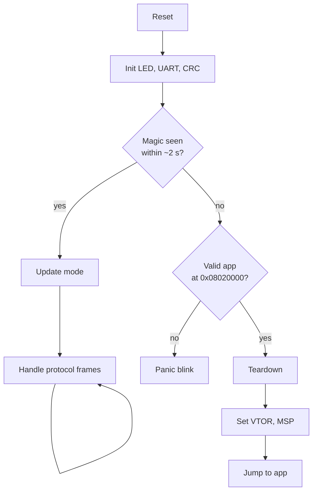
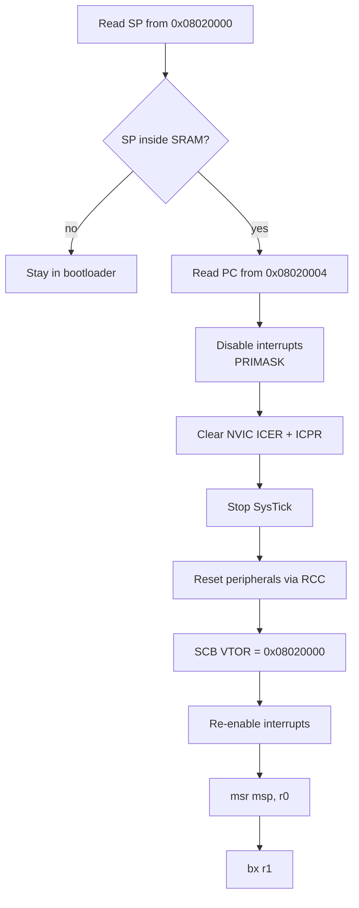
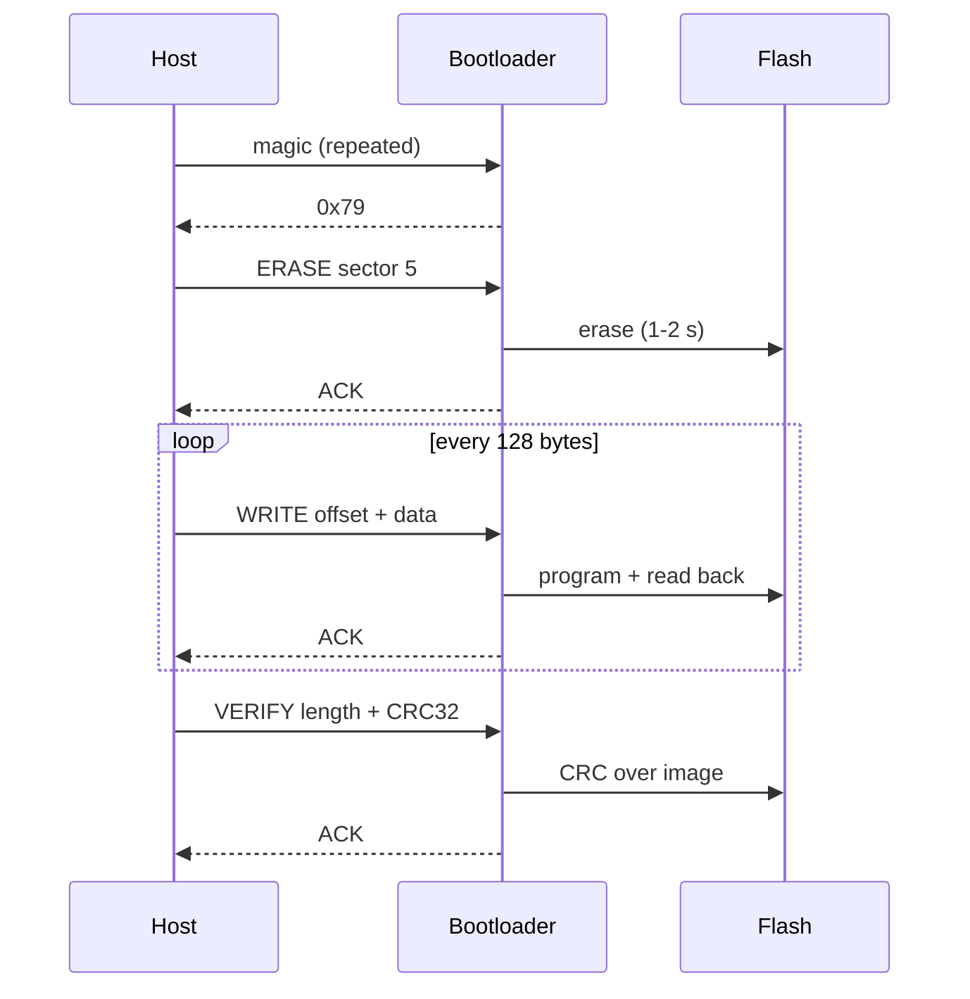

# STM32F446RE Custom Bootloader

A bare-metal bootloader for the STM32F446RE (Nucleo-64) that updates application
firmware over UART. No HAL, no CubeMX-generated code — CMSIS headers and direct
register access throughout.

Written to answer a practical question: how do you replace the firmware on a
deployed device that has no debugger attached to it?

---

## What it does

- Boots, listens for a magic sequence on UART for ~2 seconds
- If the host responds, enters update mode and reprograms the application slot
- Otherwise validates the existing application and jumps to it
- If no valid application exists, stays in update mode rather than hard faulting

The host side is a Python script that frames the image, streams it in chunks,
and verifies the result with a CRC computed over the whole image.

---

## Hardware

| Item | Detail |
|---|---|
| Board | NUCLEO-F446RE |
| MCU | STM32F446RE, Cortex-M4F, 512 KB flash, 128 KB SRAM |
| Clock | HSI, 16 MHz (no PLL — keeps teardown simple) |
| UART | USART2, PA2/PA3, 115200 8N1 |
| LED | LD2 on PA5 (also SPI1_SCK) |

USART2 is routed through the on-board ST-Link to a USB virtual COM port, so no
external adapter is needed.

---

## Memory map

Flash sectors on the F4 are not uniform. Erase granularity is one whole sector,
so every partition boundary must be sector-aligned.

| Sector | Address | Size | Use |
|---|---|---|---|
| 0–2 | `0x0800_0000` | 48 KB | Bootloader |
| 3 | `0x0800_C000` | 16 KB | Reserved for metadata |
| 4 | `0x0801_0000` | 64 KB | Unused |
| 5 | `0x0802_0000` | 128 KB | Application |
| 6 | `0x0804_0000` | 128 KB | Reserved for second slot |
| 7 | `0x0806_0000` | 128 KB | Unused |

SRAM spans `0x2000_0000` to `0x2001_FFFF`. Both images declare the full 128 KB —
they never run at the same time.

### Linker scripts

Bootloader:

```
FLASH (rx) : ORIGIN = 0x08000000, LENGTH = 48K
```

Application:

```
FLASH (rx) : ORIGIN = 0x08020000, LENGTH = 128K
```

The application origin is the change most easily missed. Without it the image
compiles with absolute addresses pointing into the bootloader's region, and the
jump lands somewhere arbitrary.

---

## Boot flow



Staying in update mode when no valid application exists is deliberate. A device
with nothing to boot should remain recoverable rather than fault.

---

## The jump

Handing control to the application is not a function call — it is closer to a
synthetic reset. The application was compiled expecting a freshly-reset machine,
so everything the bootloader configured has to be undone first.



### Why each step matters

**VTOR.** The application's vector table sits at its own base address. Without
updating `SCB->VTOR`, every interrupt vectors into the bootloader's table. The
application's `main()` runs fine and then dies the moment any interrupt fires.

**SysTick.** Lives in the System Control Space, not the NVIC — clearing `ICER`
and `ICPR` does not touch it. The most commonly missed step. Symptom is a hard
fault a few milliseconds after a jump that appeared to succeed.

**Pending interrupts.** Disabling a line leaves its pending bit set. The
application enables that peripheral, the stale request fires immediately, and
the handler runs before anything is initialised.

**Re-enabling interrupts.** `PRIMASK` survives the jump and the application's
`Reset_Handler` never clears it. Omitting `__enable_irq()` produces an
application that runs but in which no interrupt ever fires.

**Setting MSP.** Once the stack pointer moves, the current function's locals and
return address are unreachable — they lived on the abandoned stack. The
transition is therefore a `naked` function with inline assembly:

```c
__attribute__((naked, noreturn))
static void jump_to_app(uint32_t sp, uint32_t pc)
{
    __asm volatile (
        "msr msp, r0 \n"
        "bx  r1      \n"
    );
}
```

Arguments arrive in `r0` and `r1` per AAPCS, so no stack is touched at all.
`bx` takes Thumb state from bit 0 of `r1`, which the linker already set in the
vector table entry — the reset vector reads as an odd address for that reason.

---

## Protocol

UART delivers bytes in order with no concept of a message boundary. The frame
layer supplies delimitation, length, and integrity.

```
+--------+---------+---------+--------------+------------+
| SOF    | LEN     | CMD     | PAYLOAD      | CRC32      |
| 0xA5   | 2 bytes | 1 byte  | 0..255 bytes | 4 bytes    |
+--------+---------+---------+--------------+------------+
```

- `LEN` is little-endian and covers `CMD` plus payload
- `CRC32` covers `SOF`, `LEN`, `CMD`, and payload — everything before itself
- Responses reuse the same format with `CMD` set to `0x79` (ACK) or `0x1F` (NAK)
- A NAK carries a one-byte reason code

`SOF` is the resynchronisation point. On a framing error the parser discards
bytes until it sees `0xA5` and starts fresh. It does not need to be unique
within the stream — once past `SOF` the parser reads a fixed count from `LEN`
rather than scanning for delimiters.

Including `LEN` in the CRC matters: a corrupted length field is the worst
failure mode, because it desynchronises every subsequent frame.

### Commands

| Command | Code | Payload | Response |
|---|---|---|---|
| `GET_INFO` | `0x01` | none | version, slot |
| `ERASE` | `0x02` | sector (1 B) | ACK / NAK |
| `WRITE` | `0x03` | offset (4 B) + data | ACK / NAK |
| `VERIFY` | `0x04` | length (4 B) + CRC32 (4 B) | ACK / NAK |

### NAK reasons

| Code | Meaning |
|---|---|
| `0x01` | Frame CRC mismatch |
| `0x02` | Bad length |
| `0x03` | Unknown command |
| `0x04` | Flash error |
| `0x05` | Image verification failed |

---

## Update sequence



### Flow control

Programming blocks for roughly 30 µs per word, so a 128-byte chunk stalls the
receiver for about 1 ms. At 115200 baud a byte arrives every 87 µs — eleven
bytes would arrive unread and overrun the single-byte receive register.

The ACK-per-chunk structure solves this without extra mechanism: nothing is in
flight while flash is busy. The cost is a round trip per chunk, putting
effective throughput at roughly 60% of line rate. Acceptable for an operation
performed once.

---

## CRC

The F446's CRC unit is fixed: polynomial `0x04C11DB7`, initial value
`0xFFFFFFFF`, no input or output bit reversal, no final XOR. That combination
is the variant known as **CRC-32/MPEG-2**.

Two consequences worth stating plainly:

**Python's `zlib.crc32` does not match.** It uses the same polynomial but
reflects input and output and applies a final XOR. The host implements MPEG-2
directly.

**`CRC_DR` is word-access only on the F4.** Byte and half-word access to the
data register was added in later families. Bytes are packed four at a time,
most-significant first, since that is the order the unit consumes a word. A
tail shorter than four bytes is zero-padded, and the host pads identically.

CRC detects corruption. It provides no authentication — anyone can compute a
valid CRC for arbitrary firmware. Authenticity would require a signature scheme
such as ECDSA over SHA-256 with the public key held in the bootloader.

---

## Integrity layers

Four independent checks, each catching something the others cannot:

| Layer | Catches |
|---|---|
| Frame CRC | Corruption of a packet in transit |
| `FLASH_SR` flags | Controller rejected the operation |
| Read-back verify | Cells did not take the data |
| Whole-image CRC | A chunk lost entirely, or written out of order |

The per-frame CRC cannot detect a missing chunk — that frame was fine, it simply
never arrived. Only the whole-image check covers that case.

---

## Flash driver notes

**Unlock.** Write `0x45670123` then `0xCDEF89AB` to `FLASH_KEYR`. Wrong value or
order locks the controller until the next reset.

**PSIZE.** Set to `0b10` (x32), which requires Vdd between 2.7 V and 3.6 V. The
Nucleo runs at 3.3 V so this is legal, and roughly four times faster than x8.

**Erase timing.** A 128 KB sector takes 1–2 seconds. The host timeout for
`ERASE` must be longer than for data chunks.

**Cache invalidation.** The ART accelerator holds cached copies of flash. After
any modification the instruction and data caches are disabled, reset, and
restored — otherwise reads may return stale data and produce corruption that
appears random.

**Sector guard.** The driver rejects any sector below 3 and any address below
`0x0800_C000`. Never erase the sector you are executing from; the CPU stalls on
its own instruction fetch. The check lives in the driver rather than the caller
because the sector number ultimately arrives over UART.

**Bytes only go 1 → 0.** Programming can clear bits but never set them.
Rewriting an unerased location yields a bitwise AND of old and new, with no
error flag raised.

---

## Building

Two independent CubeIDE projects, both **Empty** type with CMSIS headers copied
in manually. No HAL driver tree.

```
bootloader/
├── Inc/      flash.h  uart.h  crc.h  proto.h
├── Src/      main.c  flash.c  uart.c  crc.c  proto.c
├── CMSIS/    Device/  Include/
├── Startup/  startup_stm32f446retx.s
└── STM32F446RETX_FLASH.ld

app/
├── Inc/      uart.h
├── Src/      main.c  uart.c
├── CMSIS/
├── Startup/
└── STM32F446RETX_FLASH.ld
```

Required project settings, both projects:

- Include paths: `../CMSIS/Device`, `../CMSIS/Include`, `../Inc`
- Defined symbol: `STM32F446xx`
- MCU Post build outputs: enable **Convert to binary file**

The `.bin` is required — it contains only the bytes destined for flash, with no
ELF headers or symbol tables.

---

## Usage

Initial programming, via STM32CubeProgrammer (uncheck full chip erase):

1. Flash `bootloader/Debug/bootloader.elf`
2. Flash `app/Debug/app.elf`

Subsequent updates over UART:

```
pip install pyserial
python host.py app/Debug/app.bin
```

Press RESET when prompted. The host sends the magic sequence continuously and
proceeds once the bootloader answers.

```
press RESET on the board...
bootloader responded
image 864 bytes
erasing... ok
writing... 100%
verifying A3819F0F... ok
done - press RESET to run the new app
```

---


## Reference

- RM0390 — STM32F446 reference manual, section 3 (embedded flash), section 24 (USART), section 6 (CRC)
- PM0214 — Cortex-M4 programming manual, vector table and VTOR
- UM1724 — Nucleo-64 user manual, LD2 and USER button wiring
